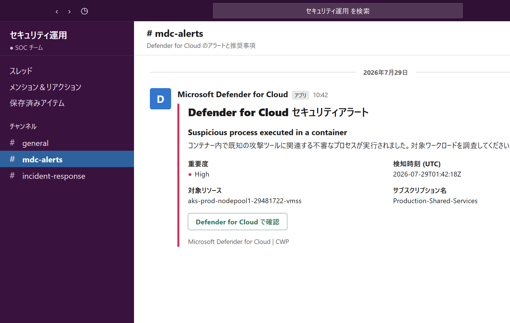
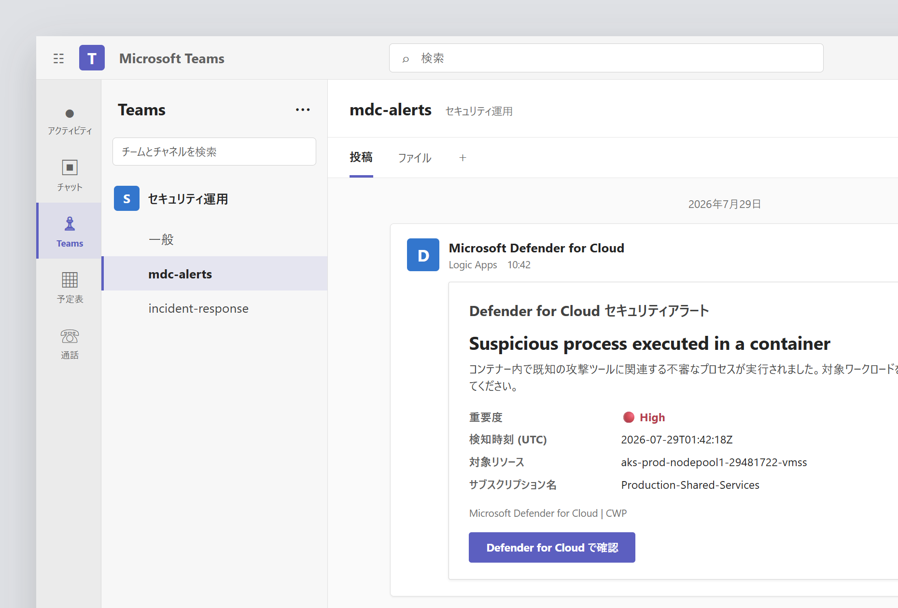
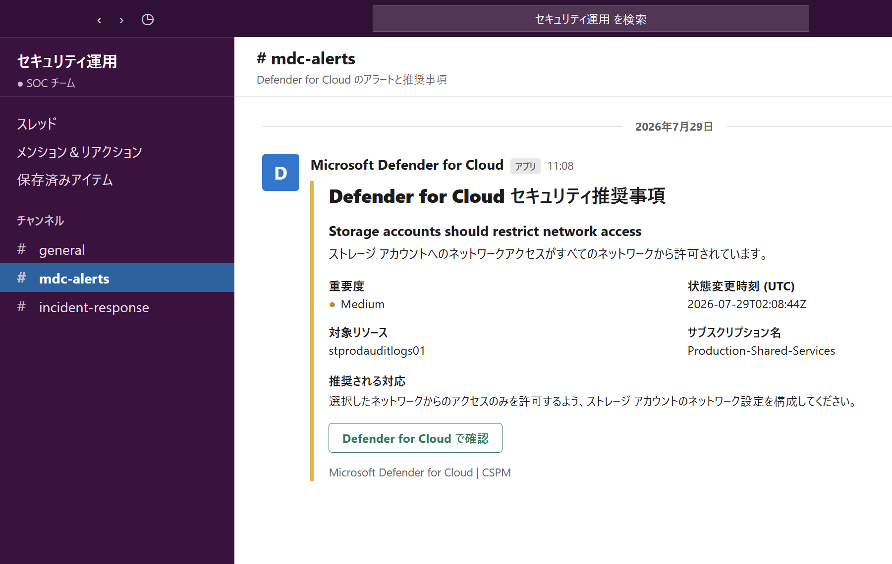
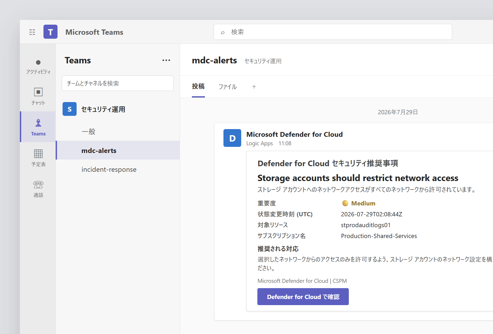

# Microsoft Defender for Cloud notifications for Slack and Microsoft Teams

Microsoft Defender for Cloud の Workflow Automation から Logic Apps を起動し、CWP セキュリティアラートと CSPM セキュリティ推奨事項を Slack または Microsoft Teams のチャネルへ通知する ARM テンプレートです。

- Slack: Incoming Webhook を使用した Block Kit 通知
- Slack 複数サブスクリプション版: サブスクリプション名による Logic Apps の Switch/Case でチャネルを振り分け
- Slack 複数サブスクリプション版では Workflow Automation を作成せず、デプロイ後に Defender for Cloud で手動設定
- Microsoft Teams: 標準 Teams コネクタを使用した Adaptive Card 通知
- CWP: 通知するアラート重要度を選択可能
- CSPM: すべて、または指定した Assessment ID の unhealthy な推奨事項を通知
- Workflow Automation の対象範囲: デプロイ先リソースグループが属するサブスクリプション全体

## 通知イメージ

### CWP セキュリティアラート

| Slack Block Kit | Microsoft Teams Adaptive Card |
| --- | --- |
|  |  |

### CSPM セキュリティ推奨事項

| Slack Block Kit | Microsoft Teams Adaptive Card |
| --- | --- |
|  |  |

画像内のリソース名、サブスクリプション名、日時などはサンプルデータです。

## テンプレートをデプロイ

通知先とイベント種別を選び、対応する **Deploy to Azure** ボタンからデプロイしてください。Azure portal でサブスクリプション、リソースグループ、リージョン、通知先などのパラメーターを入力できます。

| 通知先 | イベント | 通知条件 | ARM テンプレート | デプロイ |
| --- | --- | --- | --- | --- |
| Slack | CWP セキュリティアラート | `alertSeverities` で指定した重要度 | [cwp-template.json](cwp-template.json) | [](https://portal.azure.com/#create/Microsoft.Template/uri/https%3A%2F%2Fraw.githubusercontent.com%2Fhisashin0728%2FMdcCspmCwpNotificationSlackTeams%2Fmain%2Fcwp-template.json) |
| Slack | CSPM セキュリティ推奨事項 | unhealthy、必要に応じて Assessment ID を指定 | [cspm-template.json](cspm-template.json) | [](https://portal.azure.com/#create/Microsoft.Template/uri/https%3A%2F%2Fraw.githubusercontent.com%2Fhisashin0728%2FMdcCspmCwpNotificationSlackTeams%2Fmain%2Fcspm-template.json) |
| Slack（サブスクリプション別） | CWP セキュリティアラート | Workflow Automation で手動設定 | [multi-subscription-cwp-template.json](multi-subscription-cwp-template.json) | [](https://portal.azure.com/#create/Microsoft.Template/uri/https%3A%2F%2Fraw.githubusercontent.com%2Fhisashin0728%2FMdcCspmCwpNotificationSlackTeams%2Fmain%2Fmulti-subscription-cwp-template.json) |
| Slack（サブスクリプション別） | CSPM セキュリティ推奨事項 | Workflow Automation で手動設定 | [multi-subscription-cspm-template.json](multi-subscription-cspm-template.json) | [](https://portal.azure.com/#create/Microsoft.Template/uri/https%3A%2F%2Fraw.githubusercontent.com%2Fhisashin0728%2FMdcCspmCwpNotificationSlackTeams%2Fmain%2Fmulti-subscription-cspm-template.json) |
| Microsoft Teams | CWP セキュリティアラート | `alertSeverities` で指定した重要度 | [teams-cwp-template.json](teams-cwp-template.json) | [](https://portal.azure.com/#create/Microsoft.Template/uri/https%3A%2F%2Fraw.githubusercontent.com%2Fhisashin0728%2FMdcCspmCwpNotificationSlackTeams%2Fmain%2Fteams-cwp-template.json) |
| Microsoft Teams | CSPM セキュリティ推奨事項 | unhealthy、必要に応じて Assessment ID を指定 | [teams-cspm-template.json](teams-cspm-template.json) | [](https://portal.azure.com/#create/Microsoft.Template/uri/https%3A%2F%2Fraw.githubusercontent.com%2Fhisashin0728%2FMdcCspmCwpNotificationSlackTeams%2Fmain%2Fteams-cspm-template.json) |

> [!IMPORTANT]
> Deploy to Azure ボタンは、テンプレートが GitHub の `main` ブランチへ公開された後に利用できます。

## Slack 複数サブスクリプション版

複数サブスクリプション版は Logic App と Defender for Cloud API 接続だけをデプロイします。Defender for Cloud の Workflow Automation は ARM テンプレートに含まれないため、デプロイ後に各サブスクリプションで手動設定します。Logic App は通知元の Subscription ID を payload から取得し、System Assigned Managed Identity で Azure Resource Graph に問い合わせてサブスクリプション名へ変換します。Switch アクションは取得したサブスクリプション名だけを判定し、サブスクリプションごとの Slack Incoming Webhook へ通知します。

| CASE | サブスクリプション名 | Subscription Name パラメーター | Webhook URL パラメーター |
| --- | --- | --- | --- |
| `AzureMgmt` | `ME-MngEnvMCAP780637-AzureMgmt` | `azureMgmtSubscriptionName` | `azureMgmtSlackWebhookUrl` |
| `AzureVnet` | `ME-MngEnvMCAP780637-AzureVnet` | `azureVnetSubscriptionName` | `azureVnetSlackWebhookUrl` |

CASE に一致しないサブスクリプションは default 分岐となり、Slack へ通知しません。Azure Resource Graph の問い合わせに失敗した場合も後続の Slack 通知は実行されません。Webhook URL は `string` パラメーターとして Azure portal のデプロイ画面で入力できます。

CWP はアラート payload の `AzureResourceSubscriptionId`、`WorkspaceSubscriptionId`、`ExtendedProperties.EffectiveSubscriptionId` の順に Subscription ID を取得します。CSPM は推奨事項 payload の `properties.resourceDetails.id` から Subscription ID を取得します。その ID を対象に Azure Resource Graph の `ResourceContainers` を検索し、返された `name` と CASE を比較します。

### CWP セキュリティアラート

[](https://portal.azure.com/#create/Microsoft.Template/uri/https%3A%2F%2Fraw.githubusercontent.com%2Fhisashin0728%2FMdcCspmCwpNotificationSlackTeams%2Fmain%2Fmulti-subscription-cwp-template.json)

2つのサブスクリプション名と Webhook URL を入力して Logic App をデプロイします。通知対象の重要度は、デプロイ後に Defender for Cloud の Workflow Automation で設定します。

### CSPM セキュリティ推奨事項

[](https://portal.azure.com/#create/Microsoft.Template/uri/https%3A%2F%2Fraw.githubusercontent.com%2Fhisashin0728%2FMdcCspmCwpNotificationSlackTeams%2Fmain%2Fmulti-subscription-cspm-template.json)

2つのサブスクリプション名と Webhook URL を入力して Logic App をデプロイします。通知対象の推奨事項や状態は、デプロイ後に Defender for Cloud の Workflow Automation で設定します。

> [!NOTE]
> デプロイ後、Logic App の System Assigned Managed Identity に、通知元となる各サブスクリプションの `Reader` ロールを付与してください。権限がないサブスクリプションは Azure Resource Graph の結果に含まれません。

### Azure Resource Graph の RBAC を設定

テンプレートの出力 `alertLogicAppPrincipalId` または `recommendationLogicAppPrincipalId` で Managed Identity の principal ID を確認できます。各 Logic App に対して、通知元となる両方のサブスクリプションで次のコマンドを実行します。

```azurecli
az role assignment create \
  --assignee-object-id <LOGIC_APP_PRINCIPAL_ID> \
  --assignee-principal-type ServicePrincipal \
  --role Reader \
  --scope /subscriptions/<SOURCE_SUBSCRIPTION_ID>
```

`Reader` は対象サブスクリプション内のリソースを参照できる広い権限です。Logic App とリソースグループの変更権限、およびロール割り当てを実行できる権限を必要最小限の担当者に限定してください。

### Workflow Automation を手動設定

1. Azure portal で対象サブスクリプションの Microsoft Defender for Cloud を開きます。
2. 「ワークフローの自動化」から新しい Automation を作成します。
3. CWP は Security alert、CSPM は Security recommendation をイベントソースとして選択します。
4. 重要度、推奨事項、状態などの通知条件と対象スコープを設定します。
5. アクションに Logic App を指定し、同じサブスクリプションへデプロイした `<namePrefix>-cwp-alert` または `<namePrefix>-cspm-recommendation` を選択します。
6. Automation を有効化して保存します。

## デプロイされるリソース

| リソース | Slack | Slack 複数版 | Microsoft Teams | 用途 |
| --- | ---: | ---: | ---: | --- |
| `Microsoft.Logic/workflows` | 1 | 1 | 1 | 通知ワークフロー |
| `Microsoft.Web/connections` | 1 | 1 | 2 | Defender for Cloud トリガー、Teams コネクタ |
| `Microsoft.Security/automations` | 1 | 0 | 1 | Defender for Cloud Workflow Automation。複数版は手動作成 |

Teams テンプレートでは Defender for Cloud と Microsoft Teams の API 接続を1つずつ作成します。

## 前提条件

- 対象サブスクリプションで必要な Microsoft Defender for Cloud プランが有効であること
- リソースグループへ Logic App と API 接続を作成できる権限
- Defender for Cloud の Workflow Automation を作成できる権限
- 複数サブスクリプション版: Logic App の Managed Identity へ通知元サブスクリプションの `Reader` ロールを割り当てられる権限
- Slack: Slack アプリで発行した Incoming Webhook URL
- Microsoft Teams: 対象チーム/チャネルへ投稿できる Microsoft 365 アカウント、Team ID、Channel ID

## デプロイパラメーター

### 共通

| パラメーター | 必須 | 説明 | 既定値 |
| --- | --- | --- | --- |
| `location` | いいえ | Logic Apps、API 接続、Workflow Automation のリージョン | リソースグループのリージョン |
| `namePrefix` | いいえ | 作成するリソース名のプレフィックス | Slack: `mdc-slack`、Teams: `mdc-teams` |
| `tags` | いいえ | 作成するリソースへ付与するタグ | テンプレート内の既定タグ |

### Slack

既存の単一通知先テンプレート:

| パラメーター | 必須 | 説明 |
| --- | --- | --- |
| `slackWebhookUrl` | はい | 通知先の Slack Incoming Webhook URL。ARM の `securestring` として扱われます。 |

複数サブスクリプション版テンプレート:

| パラメーター | 必須 | 説明 |
| --- | --- | --- |
| `azureMgmtSubscriptionName` | いいえ | AzureMgmt CASE に一致させるサブスクリプション名。既定値は `ME-MngEnvMCAP780637-AzureMgmt` です。 |
| `azureVnetSubscriptionName` | いいえ | AzureVnet CASE に一致させるサブスクリプション名。既定値は `ME-MngEnvMCAP780637-AzureVnet` です。 |
| `azureMgmtSlackWebhookUrl` | はい | `ME-MngEnvMCAP780637-AzureMgmt` 用 Slack Incoming Webhook URL。ARM の `string` として扱われます。 |
| `azureVnetSlackWebhookUrl` | はい | `ME-MngEnvMCAP780637-AzureVnet` 用 Slack Incoming Webhook URL。ARM の `string` として扱われます。 |

複数サブスクリプション版の Logic App は、Azure Resource Graph から取得したサブスクリプション名を Switch で評価します。登録されていないサブスクリプション名は default 分岐となり、Slack へ送信されません。サブスクリプションを追加する場合は、テンプレートの string parameter と Switch の case を追加してください。

Webhook URL は、対応する `multi-subscription-*-template.parameters.json` の `azureMgmtSlackWebhookUrl` と `azureVnetSlackWebhookUrl` の `value` を編集して設定できます。`string` の値はデプロイ履歴やリソース定義を閲覧できるユーザーから参照される可能性があるため、リソースグループと Logic App の RBAC を必要最小限に制限してください。

複数サブスクリプション版の Workflow Automation はテンプレートに含まれません。各対象サブスクリプションへテンプレートをデプロイした後、同じサブスクリプションで手動作成してください。

### Microsoft Teams

| パラメーター | 必須 | 説明 |
| --- | --- | --- |
| `teamId` | はい | 投稿先チャネルを含む Team ID (Microsoft 365 Group ID) |
| `channelId` | はい | 投稿先の Channel ID |

### CWP

| パラメーター | 必須 | 説明 | 既定値 |
| --- | --- | --- | --- |
| `alertSeverities` | いいえ | 通知する重要度。`High`、`Medium`、`Low` を指定できます。 | 3重要度すべて |

### CSPM

| パラメーター | 必須 | 説明 | 既定値 |
| --- | --- | --- | --- |
| `recommendationIds` | いいえ | 通知対象の Assessment ID (GUID) の配列。空配列の場合はすべての unhealthy な推奨事項を通知します。 | `[]` |

Assessment ID は Azure Resource Graph Explorer で確認できます。

```kusto
securityresources
| where type =~ 'microsoft.security/assessments'
| project recommendationId = name, recommendation = properties.displayName
| order by recommendation asc
```

## Teams API 接続を認証

ARM デプロイだけでは Microsoft Teams コネクタの OAuth 認証は完了しません。Teams テンプレートをデプロイした後、次の手順を実行してください。

1. Azure portal でデプロイ先のリソースグループを開きます。
2. `<namePrefix>-teams` という名前の API 接続を開きます。
3. 「API 接続の編集」から Microsoft 365 アカウントでサインインします。
4. 接続を保存し、状態が「接続済み」であることを確認します。

CWP と CSPM を同じリソースグループへ同じ `namePrefix` でデプロイした場合は、同じ Teams API 接続を使用します。

## Azure CLI でデプロイ

パラメーターファイルを編集し、Azure CLI からデプロイすることもできます。

```powershell
$resourceGroup = '<RESOURCE-GROUP-NAME>'
$location = '<AZURE-REGION>'

az group create --name $resourceGroup --location $location

az deployment group create `
  --resource-group $resourceGroup `
  --template-file .\teams-cwp-template.json `
  --parameters .\teams-cwp-template.parameters.json
```

Slack の場合は Webhook URL をソース管理へ保存せず、実行時に渡してください。

```powershell
$slackWebhookUrl = Read-Host 'Slack Incoming Webhook URL'

az deployment group create `
  --resource-group $resourceGroup `
  --template-file .\cwp-template.json `
  --parameters .\cwp-template.parameters.json `
  --parameters slackWebhookUrl=$slackWebhookUrl
```

複数サブスクリプション版では、専用パラメーターファイルのプレースホルダーを各通知先の Webhook URL に変更してからデプロイできます。サブスクリプション名は既定値を使用できます。コマンド実行時に上書きする場合は次のように指定します。

```powershell
$azureMgmtSlackWebhookUrl = Read-Host 'AzureMgmt Slack Incoming Webhook URL'
$azureVnetSlackWebhookUrl = Read-Host 'AzureVnet Slack Incoming Webhook URL'
$azureMgmtSubscriptionName = 'ME-MngEnvMCAP780637-AzureMgmt'
$azureVnetSubscriptionName = 'ME-MngEnvMCAP780637-AzureVnet'

az deployment group create `
  --resource-group $resourceGroup `
  --template-file .\multi-subscription-cwp-template.json `
  --parameters .\multi-subscription-cwp-template.parameters.json `
  --parameters azureMgmtSubscriptionName=$azureMgmtSubscriptionName azureVnetSubscriptionName=$azureVnetSubscriptionName `
    azureMgmtSlackWebhookUrl=$azureMgmtSlackWebhookUrl azureVnetSlackWebhookUrl=$azureVnetSlackWebhookUrl
```

## 動作確認

1. Defender for Cloud の「ワークフローの自動化」で Automation が有効になっていることを確認します。
2. Teams の場合は、Teams API 接続が「接続済み」であることを確認します。
3. Defender for Cloud のアラートまたは推奨事項から「ロジック アプリのトリガー」を実行します。
4. Logic Apps の実行履歴が成功していることを確認します。
5. 対象の Slack または Teams チャネルに通知されたことを確認します。

## セキュリティ上の注意

- Slack Incoming Webhook URL はシークレットです。実値をパラメーターファイルやソース管理へコミットしないでください。
- 複数サブスクリプション版は編集性を優先して Webhook URL を `string` で扱います。実値を保存する場合はプライベートリポジトリを使用し、Azure のデプロイ履歴、リソースグループ、Logic App を参照できる RBAC ロールを必要最小限にしてください。
- API 接続には通知に使用する専用アカウントを利用し、対象チームへの必要最小限の権限を付与してください。
- デプロイ前にテンプレートと Workflow Automation のサブスクリプションスコープを確認してください。

## ファイル構成

| ファイル | 説明 |
| --- | --- |
| [cwp-template.json](cwp-template.json) | Slack CWP ARM テンプレート |
| [cspm-template.json](cspm-template.json) | Slack CSPM ARM テンプレート |
| [multi-subscription-cwp-template.json](multi-subscription-cwp-template.json) | サブスクリプション別 Slack CWP ARM テンプレート |
| [multi-subscription-cwp-template.parameters.json](multi-subscription-cwp-template.parameters.json) | サブスクリプション別 Slack CWP パラメーター例 |
| [multi-subscription-cspm-template.json](multi-subscription-cspm-template.json) | サブスクリプション別 Slack CSPM ARM テンプレート |
| [multi-subscription-cspm-template.parameters.json](multi-subscription-cspm-template.parameters.json) | サブスクリプション別 Slack CSPM パラメーター例 |
| [teams-cwp-template.json](teams-cwp-template.json) | Teams CWP ARM テンプレート |
| [teams-cspm-template.json](teams-cspm-template.json) | Teams CSPM ARM テンプレート |
| [samples/](samples/) | Slack/Teams の通知サンプル画像と再現用 HTML |

## 参考資料

- [Defender for Cloud のワークフローの自動化](https://learn.microsoft.com/azure/defender-for-cloud/workflow-automation)
- [Azure Resource Manager テンプレートのデプロイ](https://learn.microsoft.com/azure/azure-resource-manager/templates/deploy-to-azure-button)
- [Microsoft Teams コネクタ](https://learn.microsoft.com/connectors/teams/)
- [Slack Block Kit](https://api.slack.com/block-kit)
- [Adaptive Cards](https://adaptivecards.io/)